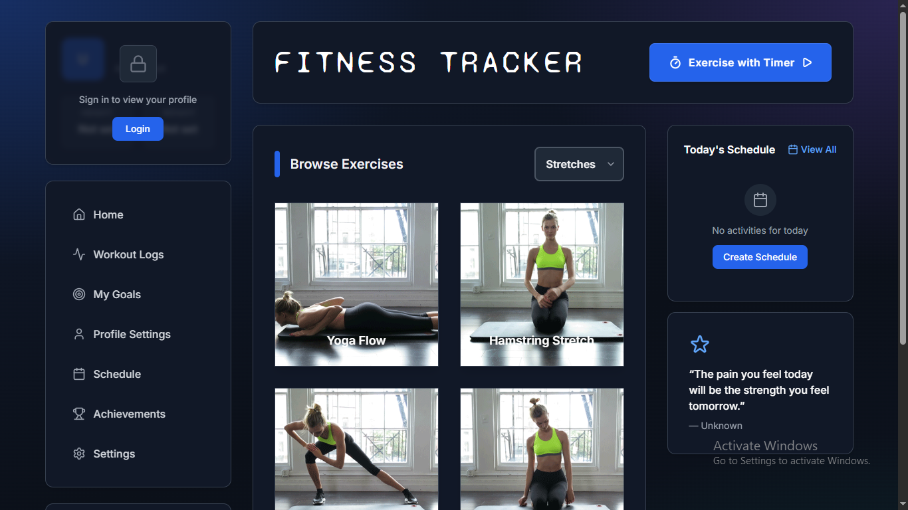
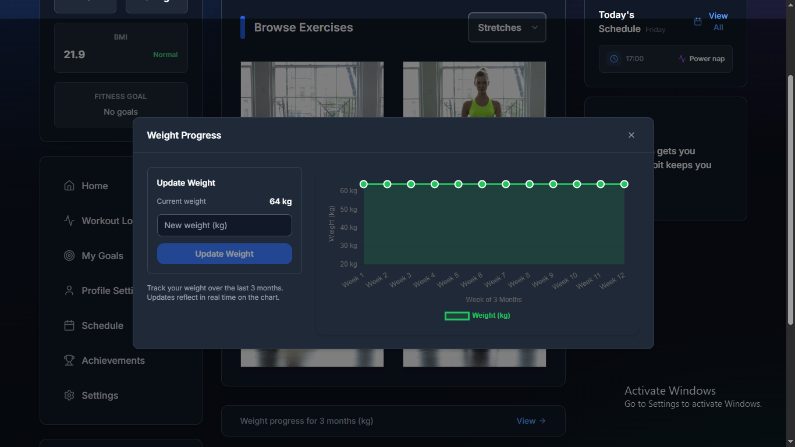
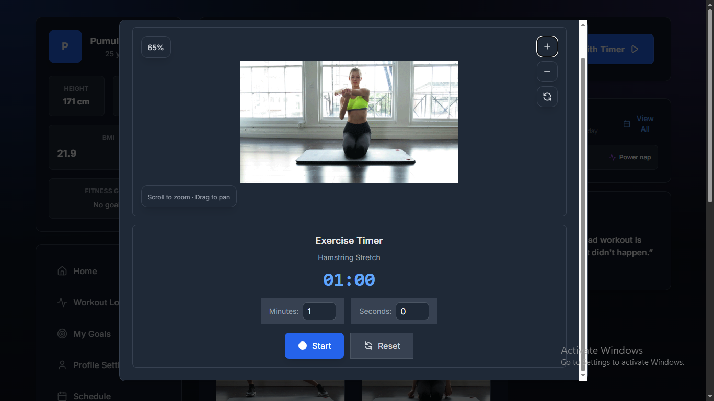

# MyFitness - Fitness Tracker Application

A comprehensive fitness tracking application to help you track your workouts, monitor progress, set goals, manage schedules, and achieve your fitness milestones.

## Features

### Dashboard & Tracking
- **Weight Progress Tracking**: Visualize your weight journey with interactive charts
- **Workout Logging**: Log workouts with duration, exercises, and notes
- **Exercise Browser**: Browse exercises by category (cardio, strength, stretching, full body)
- **Today's Schedule**: View and manage your daily workout schedule
- **Recent Workouts**: Quick access to your workout history
- **Achievements System**: Unlock achievements as you reach milestones

### Goals Management
- Create and track fitness goals (weight loss, gain, etc.)
- Set target dates and monitor progress
- Visual progress indicators
- Goal insights and recommendations

### Schedule Management
- Weekly workout schedule planning
- Day-by-day activity scheduling
- Exercise time and activity tracking
- Schedule persistence and preferences

### User Profile & Settings
- User profile management
- Unit conversion (metric/imperial)
- Theme preferences (light/dark/system)
- Language settings
- Privacy and notification preferences
- Account details management

### User Experience
- Modern, responsive UI
- Dark mode support
- Smooth animations
- Mobile-friendly design
- Error boundaries and graceful error handling

## Screenshots

### Dashboard
The main dashboard provides an overview of your fitness journey with key statistics, recent workouts, and progress tracking.

### Weight Progress
Track your weight over time with interactive charts and detailed statistics.

### Workout Logs
View and manage your complete workout history with detailed logs of all your exercise sessions.

### Workout Session
Log your workouts with exercise selection, duration tracking, and session notes.

## License

This project is licensed under the MIT License.
